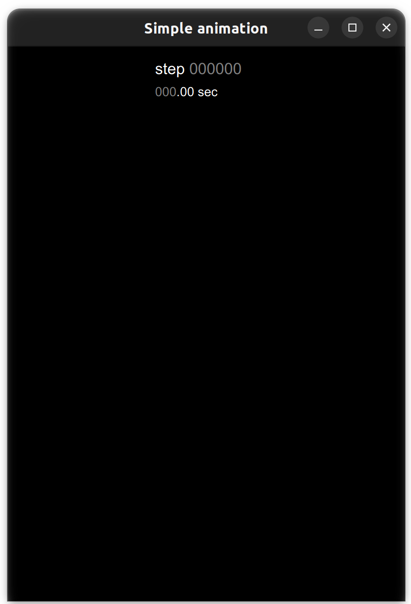

In this example, a window with a simple animation is created.

# Defining a window

First, we have to define a window object:

```python
from AE.Display.Animation.Window import *

# Define the window
W = Window('Simple animation')

W.show()
```

This code snippet generates an empty window:



You may note that the time is running by default. This can be changed by disabling autoplay before `Window.show()` with:

```python
W.autoplay = False
```


# Full code

```python
from AE.Display.Animation.Window import *
from AE.Display.Animation.Animation_2d import *

# --- 2D Animation ---------------------------------------------------------

class Anim(Animation_2d):
  '''
  This class defines the animation.

  In the constructor the variables are defined and the items to display are created.

  The update() method handles the changes to perform at every time step.
  '''

  def __init__(self):

    super().__init__()

    self.padding=0.01

    self.x0 = 0.5
    self.y0 = 0.5
    self.R = 0.25
    self.r = 0.01

    self.add(ellipse, 'E0',
      position = [self.x0, self.y0],
      major = 0.005,
      minor = 0.005,
      colors = ('white', None),
    )

    self.add(circle, 'C0',
      position = [self.x0, self.y0],
      radius = self.R,
      colors = (None, 'grey'),
      thickness = 2,
      linestyle = '--'
    )

    self.add(circle, 'C',
      position = [self.x0 + self.R, self.y0],
      radius = self.r,
      colors = ('red', None),
    )


  def update(self, t):
    
    # Update timer display
    super().update(t)

    # Update position
    x = self.x0 + self.R*np.cos(t.time)
    y = self.y0 + self.R*np.sin(t.time)
    self.item['C'].position = [x, y]

# --- Main -----------------------------------------------------------------

# Define the window
W = Window('Simple animation')

# Add animation 
W.add(Anim())

# Specify animation controls
W.allow_backward = True
W.allow_negative_time = False

W.show()
```